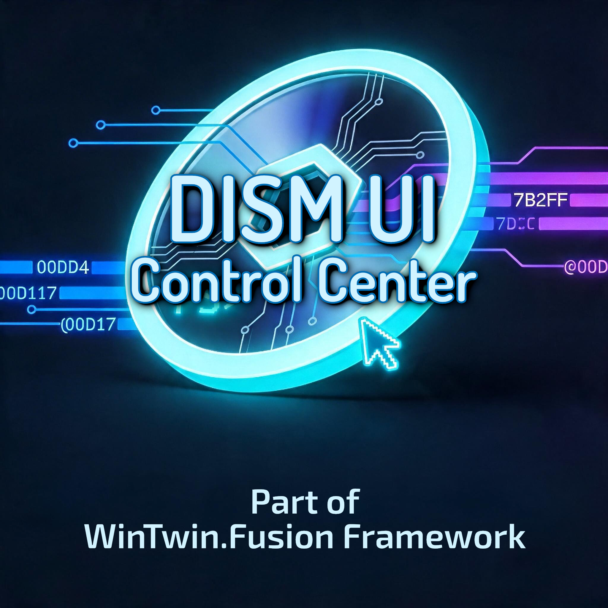

# DISM UI Control Center

  

## About

The DISM UI Control Center is a key component of the WinTwin.Fusion Framework. It provides essential functions that enable the end user to work with Windows image files via the Framework. All tools feature a graphical user interface that simplifies the process of performing tasks and actions involving Windows image files. Below is a list of the tools included in the DISM UI Control Center:

- **wim.mounter** Simple tool that helps you mounting *.wim files
- **wim.unmount** Helps you unmounting your mounted images

## Note from the Developers

DISM UI Control Center is an integral part of the WinTwin.Fusion Framework and was developed exclusively for it. During the development of DISM UI Control Center, it was not intended for this tool collection to be used in any context other than the WinTwin.Fusion Framework. While it is certainly possible that this could work for other projects, any use outside of the WinTwin.Fusion Framework is at your own risk.

