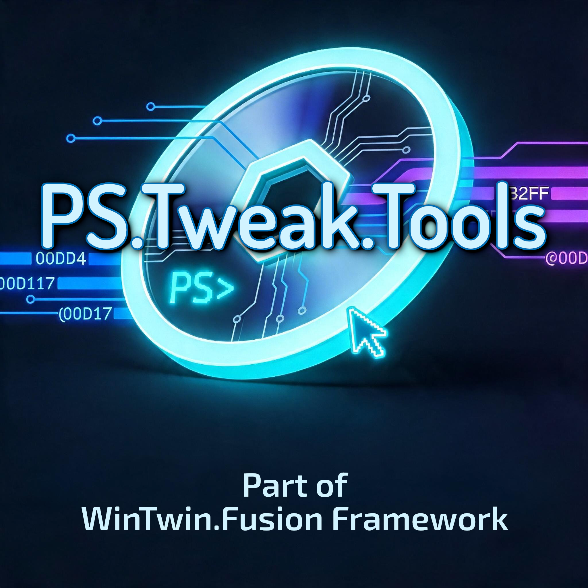

# PS.Tweak.Tools

  

## About

PS.Tweak.Tools is an integral part of the WinTwin.Fusion Framework. It is a collection of various programs (featuring user interfaces) that enable the user to perform various tasks and actions via the WinTwin.Fusion Framework. This collection includes the following tools:

- **WTF.Console** A very specialized Console Application for the WinTwin.Fusion Framework

## Note from the Developers

PS.Tweak.Tools is an integral part of the WinTwin.Fusion Framework and was developed exclusively for it. During the development of PS.Tweak.Tools, it was not intended for the tool collection to be used in any context other than the WinTwin.Fusion Framework. While it is certainly possible that this functionality could work for other projects, any use outside of the WinTwin.Fusion Framework is at your own risk.

