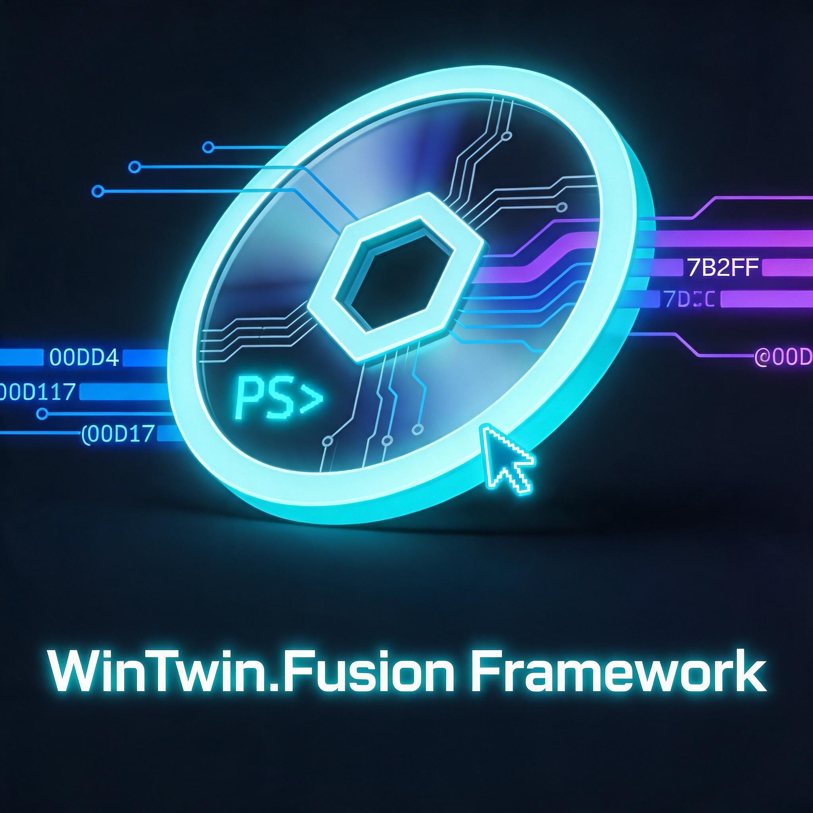

# WinTwin.Fusion

<p align="center">
  
</p>

**A unified Windows 11 imaging, migration and deployment framework, built on PowerShell.**

WinTwin.Fusion combines DISM-based offline image servicing, USMT-based user state migration, and
UUP Dump based Windows 11 image creation into a single, consistently engineered toolset. The
guiding idea behind the name is the "digital twin": after building a custom Windows 11
installation medium and performing a clean install, all previously installed programs, data and
settings can be restored, so the user can continue exactly where they left off — just on a freshly
installed Windows.

<!--
> **Source code language:** The entire WinTwin.Fusion source code base (this repository and all
> related repositories) is written in **English**, regardless of the language used in supporting
> documentation, planning notes or issue discussions.
-->

***

## Table of Contents

- [Core Idea](#core-idea)
- [Framework Components](#framework-components)
- [Repository Structure](#repository-structure)
- [Related Repositories](#related-repositories)
- [Requirements](#requirements)
- [Getting Started](#getting-started)
- [Project Status](#project-status)
- [Contributing](#contributing)
- [License](#license)

***

## Core Idea

Windows administrators typically rely on separate, disconnected tools for offline image
servicing (DISM), user profile migration (USMT) and custom installation media creation (UUP Dump
based community tooling). WinTwin.Fusion unifies these three workflows under one framework with a
shared PowerShell core module, a consistent standardized return-object contract, and (eventually) a
single graphical control center.

The end-to-end workflow WinTwin.Fusion is designed to support:

1. Build a custom, up-to-date Windows 11 image (via `uupdump.net`).
2. Service that image offline — drivers, features, packages, Appx/MSIX, Windows Capabilities,
   registry hives.
3. Back up the current system's user profile, application data, taskbar/start menu layout and
   personalization settings (USMT-based).
4. Perform a clean installation using the custom image.
5. Restore the previously backed-up profile and settings — effectively completing the "twin".

## Framework Components

| Component | Purpose | Status |
|---|---|---|
| **DISM.UI.CC** (DISM UI Control Center) | Mount/unmount WIM images and manage drivers, features, packages, Appx/MSIX packages, Windows Capabilities and offline registry hives. | `wim.mounter.ps1` in active development |
| **USMT.Composer** | Backup/restore of AppData and user data via USMT. | Planned |
| **PS.Tweak.Tools** | Standalone utility tools: `DeskPacker` (taskbar/start menu/personalization backup), `AutoClone` (automated cloning workflows), `AutoInstall` (autounattend.xml generator), `UUPDcatcher`/`UUPDisodump`/`UUPDwimdump`/`UUPDcompose` (UUP Dump GUI wrappers), `WTF.Console` (embedded terminal replacement). | Planned |
| **Core** | Shared framework runtime: `config.json`, `process.json`, `jobaction.json`, logging, language files, UI resources, fonts, export scripts and shared state. | In progress |
| **WinTwin.FXcore** | Shared framework logic library: JSON/JSONC helpers, job/process state helpers, WIM/Appx/MSIX/UUP/registry-related core functions, environment verification and standardized `OPSreturn`-based return objects. | In progress / partially integrated |
| **WinTwin.XUI** | Dedicated shared UI library for all graphical tools: XAML loading, standard file/folder dialogs, shared SVG/icon resources and reusable UI infrastructure. | Planned / repository scaffolded |
| **wintwin.installer.ps1** | Console-based framework installer (system checks, ADK/WinPE Add-on provisioning, folder structure, font installation, config generation). | Available (v0.2.0, console-only) |

## Repository Structure

```
C:\WinTwin
├── AddOns/                 # ADK / ADK WinPE setup executables, oscdimg.exe
├── Core/
│   ├── db/
│   ├── export/
│   ├── fonts/               # Google Fonts installed machine-wide by the installer
│   ├── lang/
│   ├── logs/
│   ├── ui/
│   └── config.json
├── DISM.UI.CC/               # wim.mounter.ps1, wim.unmount.ps1, wim.ctrl.*.ps1
├── Drivers/
├── Lib/
│   ├── OPSreturn/
│   ├── PSAppCoreLib/
│   ├── VPDLX/
│   └── WinTwin.FXcore/
├── Mount/
├── MSStore/
├── Output/
├── Profile.Backup/
├── PS.Tweak.Tools/
├── RawISO/
├── USMT.Composer/
├── UUPD/
├── UserData/
├── LICENSE.md
├── NOTICE
├── README.md
└── wintwin.installer.ps1
```

## Related Repositories

WinTwin.Fusion is split across several repositories under the
[WinTwin-Fusion](https://github.com/WinTwin-Fusion) organization:

- **[WinTwin.Fusion](https://github.com/WinTwin-Fusion/WinTwin.Fusion)** — this repository; the
  overall framework scaffold, installer and GUI tools.
- **[WinTwin.FXcore](https://github.com/WinTwin-Fusion/WinTwin.FXcore)** — the shared PowerShell
  function library (formerly `WinISO.ScriptFXLib`) used by every tool in the framework: WIM
  mount/unmount, UUP Dump download/extract/compose, Appx/MSIX management, offline registry hive
  editing, environment verification, and the standardized `OPSreturn` return-object contract.
- **[WinTwin.XUI](https://github.com/WinTwin-Fusion/WinTwin.XUI)** — the shared WPF/XAML UI
  helper module used by every graphical tool in the framework: XAML window loading, native
  folder/file picker dialogs, and centralized SVG/icon graphics (always defined in neutral
  white, colorized at the point of use).
- Additional shared modules referenced by the framework (`OPSreturn`, `PSAppCoreLib`, `VPDLX`) are
  maintained separately and consumed via `.\Lib`.

## Requirements

- Windows 11, version 24H2 or 25H2 (build 26100 or later)
- PowerShell 5.1 or later
- A functional DISM installation
- Windows ADK, including the Deployment Tools and User State Migration Tool features
- Windows ADK WinPE Add-on
- Administrator privileges (required for installation, ADK provisioning and machine-wide font
  installation)

## Getting Started

1. Place the entire framework folder (including `wintwin.installer.ps1`) on a drive of your
   choice, e.g. `C:\WinTwin`.
2. Open an elevated PowerShell console (Run as Administrator).
3. Run the installer:

   ```powershell
   .\wintwin.installer.ps1
   ```

4. Review the console checklist printed at the end of the run. Any failed (`[ ]`) or warned
   (`[!]`) items should be resolved before continuing to use the framework's DISM/USMT tools.

See `INSTALLER-README.md` for the full list of installer parameters and behavior.

## Project Status

WinTwin.Fusion is under active development. `WinTwin.FXcore` already provides a substantial,
versioned set of public functions covering WIM mounting, the full UUP Dump pipeline, Appx/MSIX
management and offline registry hive editing. `WinTwin.XUI` has been introduced as the framework's
dedicated shared UI/XAML library and is currently scaffolded. The console-only installer
(`wintwin.installer.ps1`) is available and functional. The DISM.UI.CC GUI tools, USMT.Composer and
PS.Tweak.Tools are in active planning/early development. See `CHANGELOG.md` for a detailed version
history and `DEV.TASKS.md` for the current task backlog.

## Contributing

This project is currently maintained as a personal/internal framework by the WinTwin-Fusion team.
All source code contributions must be written in English and must use the shared `OPSreturn`,
`WinTwin.FXcore`, `WinTwin.XUI`, `PSAppCoreLib` and (optionally) `VPDLX` modules where applicable,
per the project's internal architecture guidelines. The `main` branch is protected; all changes
must be committed via one of the dedicated development branches (e.g. `WinTwin.Core-Development`,
`DISM.UI.CC-Development`, `USMT.Composer-Development`, `PS.Twin.Tools-Development`,
`WinTwin.Feature-DevBranch`) and merged into `main` afterwards.

## License

See [`LICENSE.md`](LICENSE.md) and [`NOTICE`](NOTICE) in this repository.
