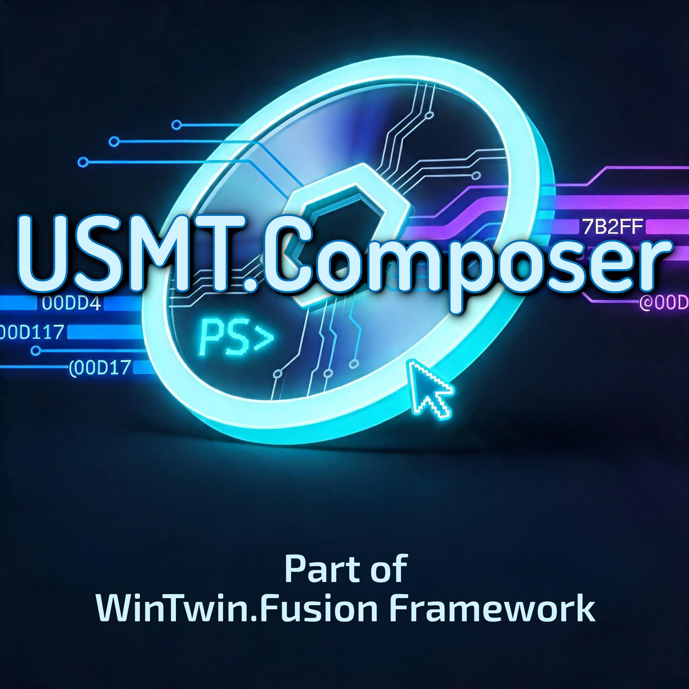

# USMT.Composer

  

## About

USMT.Composer is a core component of the WinTwin.Fusion framework and a highly important, useful addition to the framework's ecosystem. USMT.Composer makes it possible to back up data and settings from installed programs and subsequently restore these backups on another system (provided that the same applications included in the backup are also installed on the target system). Additionally, USMT.Composer can back up essential user account data and settings (such as taskbar and Start menu configurations).

## Note from the Developers

USMT.Composer is an integral part of the WinTwin.Fusion Framework and was developed exclusively for it. During the development of USMT.Composer, it was not intended for this tool to be used in any context other than the WinTwin.Fusion Framework. While it is certainly possible that this could work, any use outside of the WinTwin.Fusion Framework is at your own risk.

